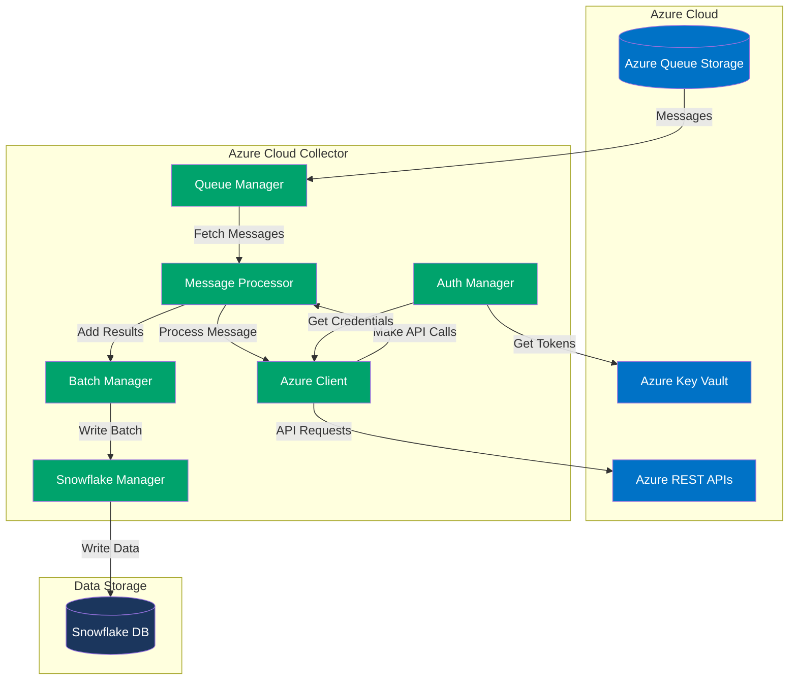

# Azure Cloud Collector

A collector service that gathers Azure cloud configuration data by making Azure API calls and stores the data in Snowflake.

## Architecture



## Features

- Collects Azure configuration data using Azure SDK
- Supports multiple commands in a single message
- Multithreaded processing for high throughput
- Batch processing with configurable size and timeout
- Automatic retries with exponential backoff
- Snowflake storage integration
- Structured logging
- Fault-tolerant message processing
- Azure Key Vault integration for secrets management

## Prerequisites

- Python 3.9 or higher
- Azure subscription with:
  - Azure Storage Account for queues
  - Azure Key Vault
  - Required RBAC permissions
- Snowflake account with:
  - Admin privileges to create warehouse/database/schema
  - User with appropriate permissions

## Installation

1. Clone the repository:
```bash
git clone https://github.com/your-org/azure-collector.git
cd azure-collector
```

2. Create and activate virtual environment:
```bash
python -m venv venv
source venv/bin/activate  # Linux/macOS
.\venv\Scripts\activate   # Windows
```

3. Install dependencies:
```bash
pip install -e .
```

## Configuration

1. Copy example environment file:
```bash
cp .env.example .env
```

2. Configure the following environment variables in `.env`:

```env
# Azure Configuration
AZURE_QUEUE_NAME=my-queue
AZURE_QUEUE_CONNECTION_STRING=your-connection-string
AZURE_KEYVAULT_URL=https://your-vault.vault.azure.net/

# Snowflake Configuration
SNOWFLAKE_ACCOUNT=your-account
SNOWFLAKE_WAREHOUSE=COLLECTOR_WAREHOUSE
SNOWFLAKE_DATABASE=COLLECTOR_DB
SNOWFLAKE_SCHEMA=COLLECTOR_SCHEMA
SNOWFLAKE_USER=your-user
SNOWFLAKE_PASSWORD=your-password

# Collector Configuration
BATCH_SIZE=1000
BATCH_TIMEOUT=10
NUM_THREADS=25
MAX_RETRIES=3
INITIAL_RETRY_DELAY=1
LOG_LEVEL=INFO
```

## Running the Collector

### Development Mode
```bash
# Activate virtual environment
source venv/bin/activate

# Run collector
python -m src.main
```

### Production Mode
```bash
# Using entry point
azure-collector

# Or using Docker
docker build -t azure-collector .
docker run -d --env-file .env azure-collector
```

## Message Format

Messages should be sent to the Azure Queue in the following format:

```json
{
    "message_id": "uuid-string",
    "correlation_id": "optional-correlation-id",
    "api_requests": [
        {
            "service": "compute",
            "api_version": "2023-07-01",
            "method": "GET",
            "resource_path": "/subscriptions/{subscriptionId}/resourceGroups/{resourceGroup}/providers/Microsoft.Compute/virtualMachines/{vmName}",
            "parameters": {
                "subscriptionId": "your-subscription-id",
                "resourceGroup": "your-resource-group",
                "vmName": "your-vm-name"
            },
            "query_params": {},
            "headers": {}
        }
    ],
    "timestamp": "2024-01-17T00:00:00Z"
}
```

## Architecture

### Components

- **Queue Manager**: Handles Azure Queue operations
- **Azure Client**: Makes Azure API calls
- **Batch Manager**: Manages batching of results
- **Snowflake Manager**: Handles data persistence
- **Message Processor**: Orchestrates message processing
- **Collector**: Main service coordinator

### Flow

1. Message arrives in Azure Queue
2. Collector retrieves message batch
3. Messages are processed concurrently
4. Results are batched
5. Batches are written to Snowflake
6. Messages are deleted from queue


### Running Tests

```bash

# Run an end to end test with all functionalities
python3 test_e2e.py

# Run all unit tests
pytest

```

### Adding New API Support

1. Add new service type to `ServiceType` enum in `message_interface.py`
2. Update `APIVersion` enum with new version
3. Add client mapping in `AzureClientFactory`
4. Create example message in `message_examples.py`

## Monitoring

### Logging

- Logs are written to stdout in structured format
- Log level configurable via LOG_LEVEL env var
- Each component includes detailed logging

### Metrics

- Message processing rate
- Batch sizes
- Processing latency
- Error rates
- API call success/failure

### Troubleshooting

Common issues and solutions:

1. Connection Issues
```bash
# Test Azure connection
azure-collector test-connection

# Test Snowflake connection
azure-collector test-snowflake
```

2. Permission Issues
- Verify Azure role assignments
- Check Snowflake grants
- Validate Key Vault access

3. Performance Issues
- Adjust BATCH_SIZE
- Modify NUM_THREADS
- Check Snowflake warehouse size

## Future Improvements

### Performance Enhancements
- Add caching layer for frequently accessed Azure resources
- Optimize batch sizes based on message types and payload sizes
- Implement rate limiting with adaptive throttling

### Reliability & Resilience
- Implement dead letter queue for failed messages
- Add message deduplication mechanism
- Implement automatic recovery from Snowflake connection losses
- Add transaction support for batch operations

### Monitoring & Observability
- Add OpenTelemetry integration for distributed tracing
- Add health check endpoints
- Create dashboard templates for monitoring
- Implement alerting based on key metrics

### Security Enhancements
- Add support for Azure Managed Identities
- Implement role-based access control (RBAC)
- Add encryption for sensitive data in transit
- Implement API request signing
- Add audit logging for security events

### Feature Additions
- Add support for custom API endpoints
- Implement message prioritization
- Add support for scheduled collection jobs
- Create API for manual trigger of collections

### Developer Experience
- Add OpenAPI/Swagger documentation
- Add development mode with mock services
- Add more example message templates

### Data Management
- Add data versioning support
- Implement data retention policies
- Add support for data transformations

### Deployment & Operations
- Add Kubernetes deployment manifests
- Create Terraform modules for infrastructure

### Configuration Management
- Add support for dynamic configuration updates
- Add environment-specific configurations
- Create configuration validation tools
- Add support for secrets rotation